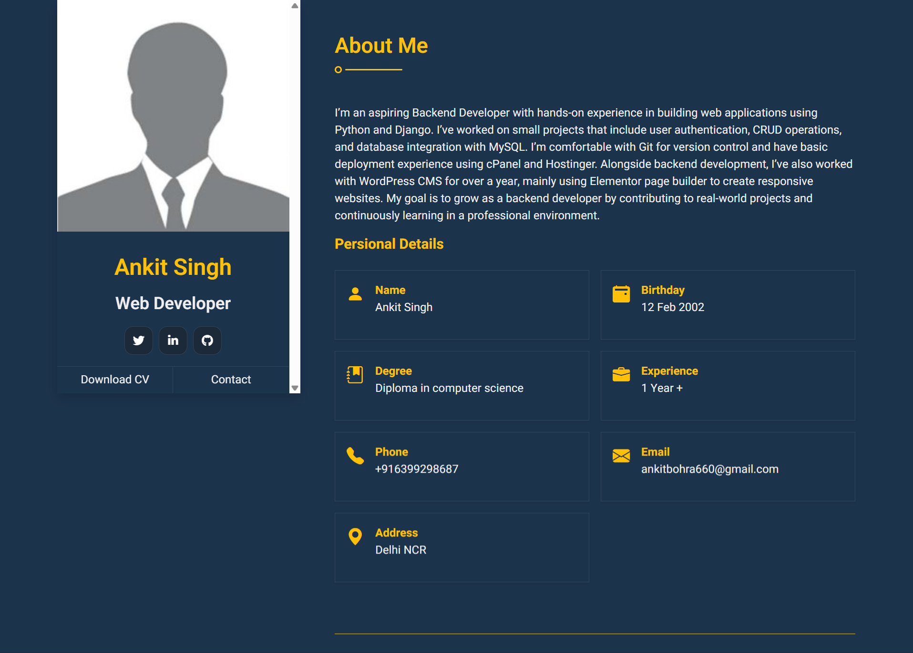
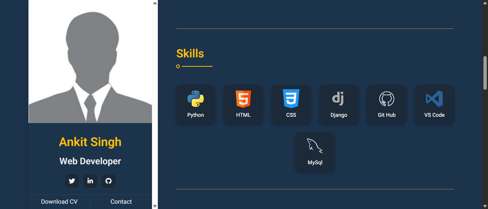
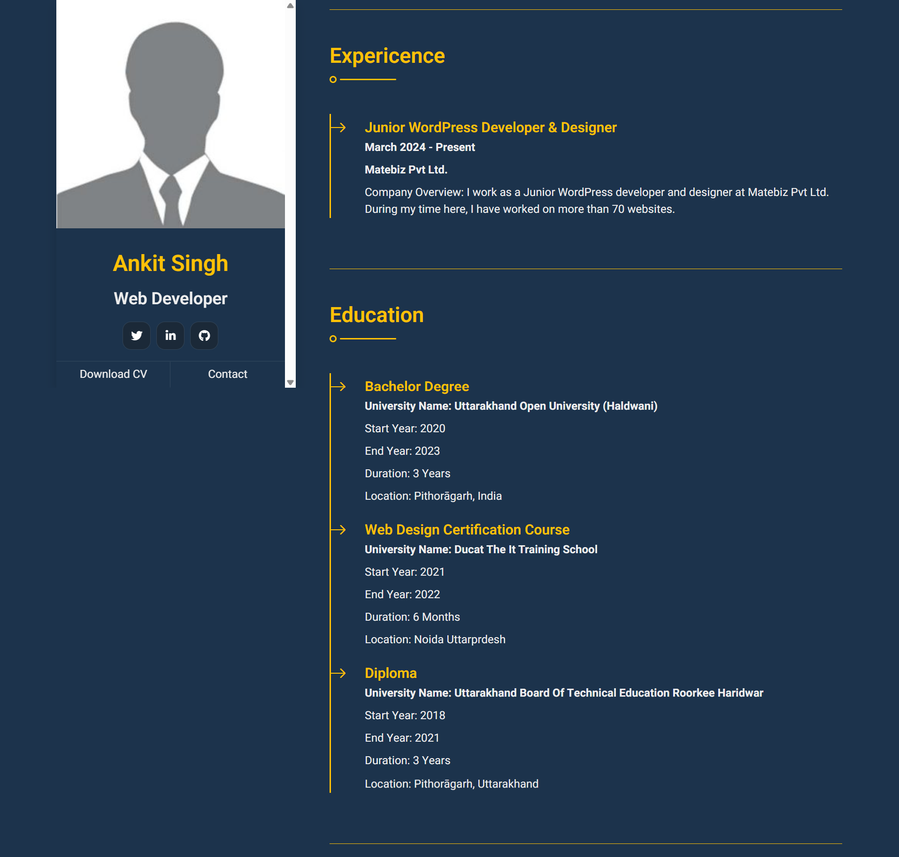
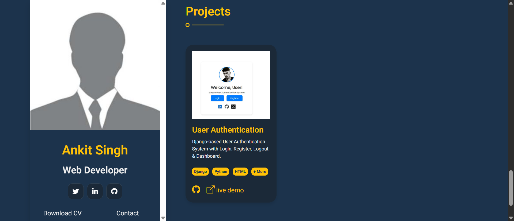

# 💼 Django Personal Portfolio - v1.0

A responsive and dynamic portfolio website built using Django and Bootstrap to showcase your professional profile, skills, experience, and projects.

---

## 📖 About The Project

This portfolio website helps individuals showcase their personal and professional information online. Built with Django (Python backend) and Bootstrap for frontend styling, it provides dynamic content management through Django admin.

It includes sections like About Me, Skills, Experience, Education, and Projects, all easily manageable without modifying any code.

---

## ✨ Features

- Responsive and modern UI with Bootstrap 5
- Dynamic About Me, Skills, Experience, and Project sections
- Django admin panel for content management
- Modular and clean code structure

---

## 🖼️ screenshort

### 🔹 About Me Section  


### 🔹 Skills Section  


### 🔹 Experience & Education  


### 🔹 Project Section  


---

## 🛠️ Tech Stack

- **Frontend:** HTML5, CSS3, Bootstrap 5
- **Backend:** Python 3, Django 4
- **Database:** SQLite
- **Deployment:** PythonAnywhere 

---

## 📦 Installation

```bash
# Clone this repository
git clone https://github.com/Hell0Ankit/portfolio.git
cd portfolio

# Create a virtual environment
python -m venv venv
venv\Scripts\activate  # On Windows

# Install requirements
pip install -r requirements.txt

# Run migrations
python manage.py migrate

# Start the development server
python manage.py runserver
